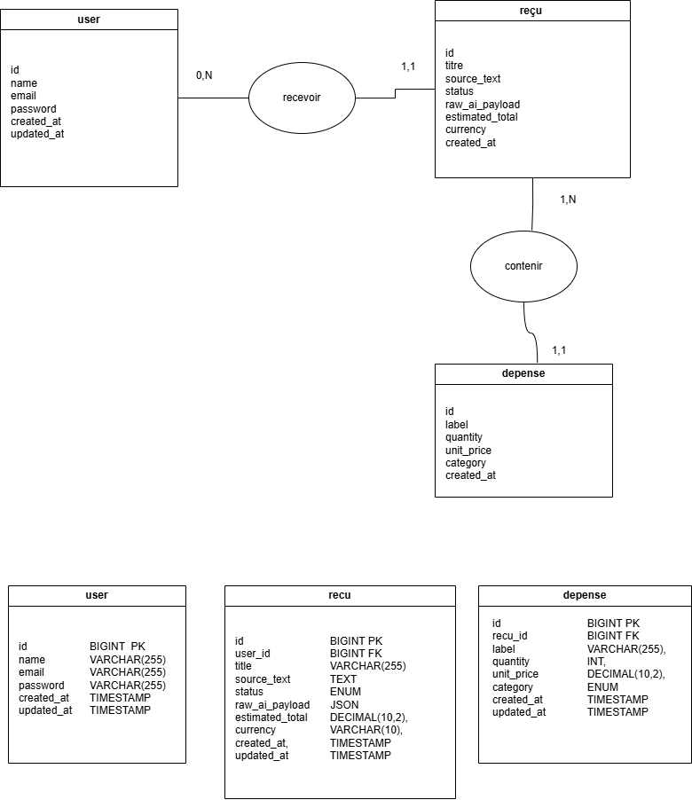
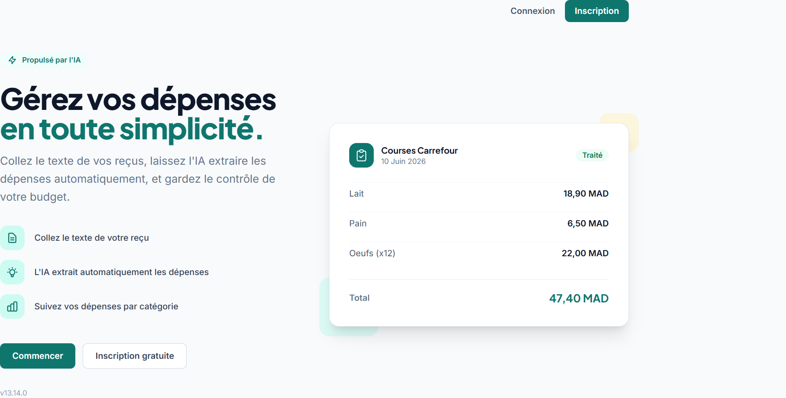
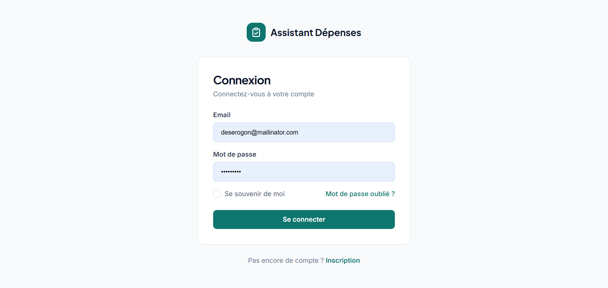
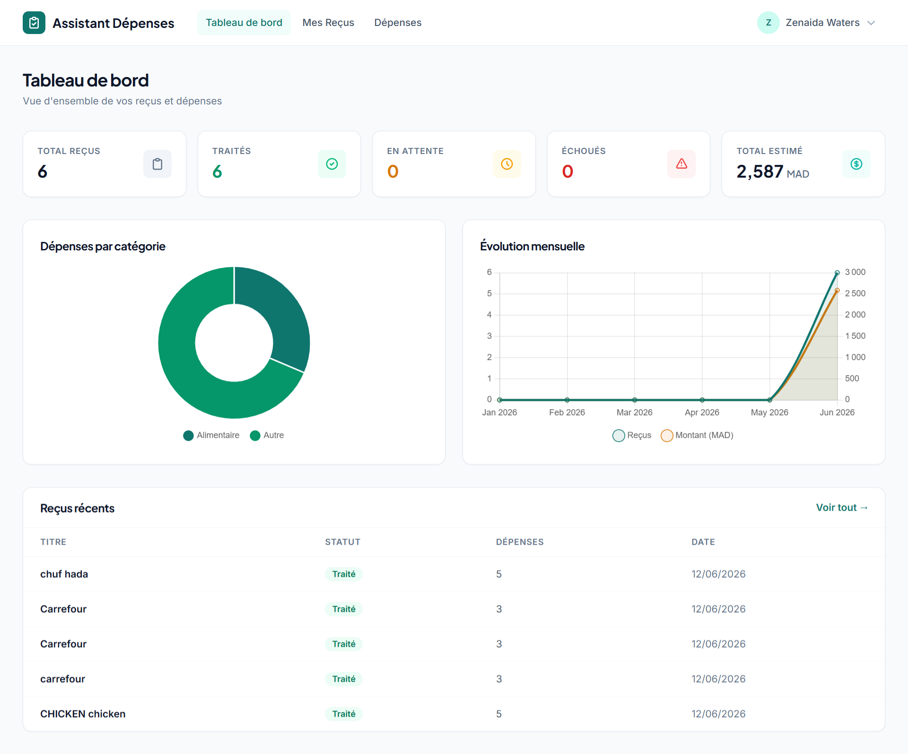
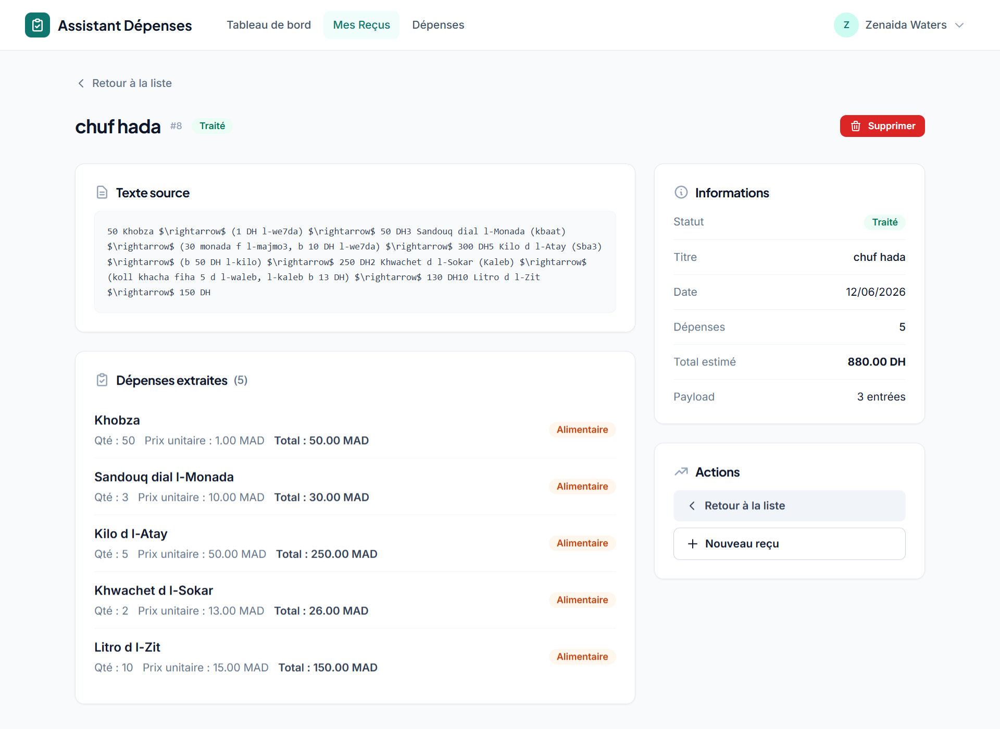
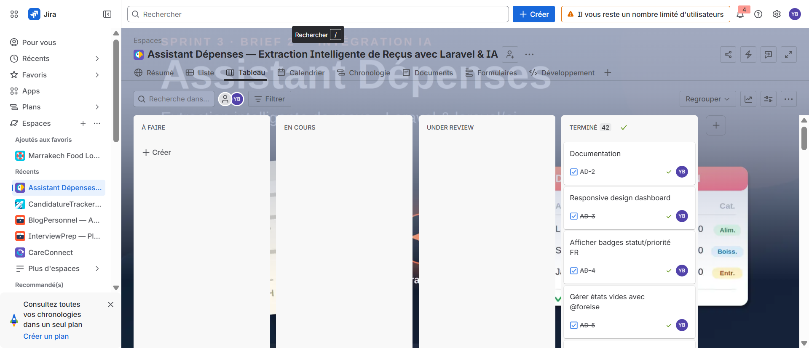

# Assistant Dépenses — Gestion intelligente de reçus

## Overview

**Assistant Dépenses** is an AI-powered expense tracking platform built with **Laravel**.

It helps users manage their receipts by automatically extracting expense items using AI (Groq API). Users paste OCR text from receipts, and the AI parses it into structured expense data — replacing manual entry and spreadsheet tracking.

The platform follows Laravel best practices using:

- MVC Architecture
- Eloquent ORM
- Blade templating
- Named routes
- Middleware authentication
- Policy-based authorization
- Form Requests validation
- Queue-based job processing

---

# 🚀 Features

# 🔐 Authentication

Users can:

- Register securely
- Login securely
- Logout securely

Authentication is powered by Laravel Breeze.

---

# 📋 Receipt Management (Reçus)

Users can:

- Create receipts with OCR text
- View receipt details
- Delete receipts
- Retry failed AI extractions

Each receipt includes:

- Titre
- Texte source (OCR)
- Total estimé
- Devise (MAD)
- Statut
- Payload brut (AI response)
- Message d'erreur

## Statut values

| Value | Label |
|---|---|
| `en_attente` | En attente |
| `traite` | Traité |
| `echoue` | Échoué |

## Relationships

- **Recu → Depenses:** One receipt has many expenses (`hasMany`)
- **User → Recus:** One user has many receipts (`hasMany`)

---

# 💰 Expense Tracking (Dépenses)

Users can:

- View all extracted expenses
- Search expenses by label
- Filter expenses by category
- Sort expenses by any column

Each expense includes:

- Libellé
- Quantité
- Prix unitaire
- Catégorie
- Référence au reçu

## Catégorie values

| Value | Label |
|---|---|
| `alimentaire` | Alimentaire |
| `boissons` | Boissons |
| `hygiene` | Hygiène |
| `entretien` | Entretien |
| `autre` | Autre |

---

# 🤖 AI Extraction

The AI extraction pipeline:

1. User creates a receipt with OCR text
2. A job is dispatched to the queue
3. The `ReceiptExtractor` agent sends the text to Groq API (Meta Llama 4 Scout)
4. AI returns structured JSON with articles and total
5. Expenses are created in the database
6. Receipt status updates to `traite` or `echoue`

## Job Configuration

- **Tries:** 3
- **Backoff:** 10s, 30s
- **Max Exceptions:** 1
- **Queue:** database

## Error Handling

- Response structure validation before processing
- Error messages stored on the receipt record
- Mail notification sent on permanent failure
- Retry button available for failed receipts

---

# 📊 Analytics Dashboard

The dashboard provides an overview of the user's expenses:

- **Total reçus** — Number of all receipts
- **Traités** — Successfully processed receipts
- **En attente** — Receipts awaiting processing
- **Échoués** — Failed receipts
- **Total estimé** — Sum of all estimated totals
- **Dépenses par catégorie** — Doughnut chart breakdown
- **Évolution mensuelle** — Line chart of receipts and amounts over time
- **Reçus récents** — Recently created receipts table

---

# 🛣 Routing System

| Method | Route | Controller | Action |
|---|---|---|---|
| GET | `/` | Closure | `welcome` |
| GET | `/dashboard` | `DashboardController` | `index` |
| GET | `/recus` | `RecuController` | `index` |
| GET | `/recus/create` | `RecuController` | `create` |
| POST | `/recus` | `RecuController` | `store` |
| GET | `/recus/{recu}` | `RecuController` | `show` |
| DELETE | `/recus/{recu}` | `RecuController` | `destroy` |
| POST | `/recus/{recu}/retry` | `RecuController` | `retry` |
| GET | `/depenses` | `DepenseController` | `index` |
| GET | `/profile` | `ProfileController` | `edit` |
| PATCH | `/profile` | `ProfileController` | `update` |
| DELETE | `/profile` | `ProfileController` | `destroy` |

---

# 🛠 Installation

### Prerequisites

- PHP 8.3+
- Composer
- Node.js + NPM
- MySQL
- XAMPP / Laragon / WAMP

### Installation Steps

1. Clone the repository

```bash
git clone https://github.com/BEN-ESSAHRAOUI-Yassine/Assistant_Depenses.git
cd Assistant_Depenses
```

2. Install dependencies

```bash
composer install
npm install
```

3. Environment configuration

```bash
cp .env.example .env
php artisan key:generate
```

4. Configure database

Edit `.env`:

```ini
DB_CONNECTION=mysql
DB_HOST=127.0.0.1
DB_PORT=3306
DB_DATABASE=assistant_depenses
DB_USERNAME=root
DB_PASSWORD=
```

5. Configure AI

Edit `.env`:

```ini
AI_PROVIDER=groq
AI_DEFAULT=groq
GROQ_API_KEY=your-groq-api-key
GROQ_MODEL=meta-llama/llama-4-scout-17b-16e-instruct
```

6. Run migrations and seeders

```bash
php artisan migrate:fresh --seed
```

7. Compile frontend assets

```bash
npm run build
```

8. Start queue worker

```bash
php artisan queue:work
```

9. Start server

```bash
php artisan serve
```

Visit:

```
http://127.0.0.1:8000
```

---

# 🧪 Testing (Pest)

The project uses **Pest PHP** — an elegant testing framework built on top of PHPUnit.

### Why Pest?

- **Cleaner syntax:** Write tests with functions instead of classes
- **Expressive:** `test('name', fn() => ...)` reads like plain English
- **Laravel integration:** `pestphp/pest-plugin-laravel` provides seamless Laravel helpers
- **Built-in features:** `RefreshDatabase`, `assertSee()`, `assertRedirect()` and more
- **Fast feedback:** Run tests with a single command

### Configuration

Pest is configured in `tests/Pest.php`:

```php
pest()->extend(TestCase::class)
    ->use(RefreshDatabase::class)
    ->in('Feature');
```

- All tests inside `tests/Feature/` automatically refresh the database
- The `phpunit.xml` file uses an **SQLite in-memory database** for testing

### Writing a new test

Create a file in `tests/Feature/` or `tests/Unit/`:

```php
<?php

use App\Models\Recu;
use App\Models\User;

test('a user can view their receipts', function () {
    $user = User::factory()->create();
    Recu::factory()->count(3)->create(['user_id' => $user->id]);

    $response = $this->actingAs($user)->get(route('recus.index'));

    $response->assertOk();
    $response->assertSee('Mes Reçus');
});
```

Run all tests with:

```bash
php artisan test
```

Run a specific file:

```bash
php artisan test tests/Feature/RecuTest.php
```

Run with coverage (requires Xdebug or PCOV):

```bash
php artisan test --coverage
```

---

# 🗄 Database Design

## MCD et MLD



## Tables

- `users`
- `recus`
- `depenses`

## Relationships

- **User → Recus:** One user has many receipts (`hasMany`)
- **Recu → Depenses:** One receipt has many expenses (`hasMany`)
- **Depense → Recu:** One expense belongs to one receipt (`belongsTo`)

## Columns

### `recus`

| Column | Type | Notes |
|---|---|---|
| `id` | bigint | PK |
| `user_id` | bigint | FK → users |
| `title` | string | |
| `texte_source` | text | OCR text |
| `estimated_total` | decimal | nullable |
| `currency` | string | default: MAD |
| `statut` | string | enum: en_attente, traite, echoue |
| `payload_brut` | json | nullable |
| `error_message` | text | nullable |
| `created_at` | timestamp | |
| `updated_at` | timestamp | |

### `depenses`

| Column | Type | Notes |
|---|---|---|
| `id` | bigint | PK |
| `recu_id` | bigint | FK → recus |
| `libelle` | string | |
| `quantite` | integer | |
| `prix_unitaire` | decimal | |
| `categorie` | string | enum: alimentaire, boissons, hygiene, entretien, autre |
| `created_at` | timestamp | |
| `updated_at` | timestamp | |

---

# 📌 Laravel Concepts Used

### Policies

Used for receipt authorization:

- Ownership verification (`user_id` match)
- `viewAny`, `create`, `view`, `delete`, `retry`

### Form Requests

Used for validation:

- `StoreRecuRequest` — Validation rules for creating receipts

### Eloquent Enum Casts

Used for type-safe enum handling:

- `StatutRecu` — Receipt status enum
- `CategorieDepense` — Expense category enum

### Named Routes

All routes are named for clean Blade references.

### Route Model Binding

Models are automatically resolved in route parameters.

### Queue Jobs

Background processing for AI extraction:

- `ExtraireDepensesDuRecu` — Processes receipt text via AI
- Database queue driver
- Retry logic with exponential backoff

### Notifications

- `ExtractionEchouee` — Mail notification on permanent job failure

---

# 🔒 Security Measures

The application implements several Laravel security best practices:

- Authentication middleware
- Password hashing
- CSRF protection
- Form Request validation
- Policy-based authorization
- Route model binding
- Protected routes

---

# 🛠 Technologies Used

- **Laravel 13**
- **PHP 8.3+**
- **MySQL**
- **Blade**
- **Eloquent ORM**
- **Laravel Breeze**
- **Tailwind CSS**
- **Vite**
- **Chart.js**
- **Alpine.js**
- **Laravel Policies**
- **Laravel Form Requests**
- **Pest PHP**
- **Groq AI API**
- **Meta Llama 4 Scout**

---

# 🐞 Debugging Tools

### Laravel Telescope

Access at `/telescope`

Used to:

- Inspect requests
- View exceptions
- Monitor queries
- Debug authorization
- Monitor queue jobs

---

# 📁 Directory Structure

```text
app/
├── Ai/
│   └── Agents/
│       └── ReceiptExtractor.php
├── Enums/
│   ├── StatutRecu.php
│   └── CategorieDepense.php
├── Http/
│   ├── Controllers/
│   │   ├── DashboardController.php
│   │   ├── RecuController.php
│   │   ├── DepenseController.php
│   │   └── ProfileController.php
│   └── Requests/
│       └── StoreRecuRequest.php
├── Jobs/
│   └── ExtraireDepensesDuRecu.php
├── Models/
│   ├── Recu.php
│   └── Depense.php
├── Notifications/
│   └── ExtractionEchouee.php
├── Policies/
│   └── RecuPolicy.php
└── Providers/
    └── AppServiceProvider.php

database/
├── factories/
│   ├── RecuFactory.php
│   ├── DepenseFactory.php
│   └── UserFactory.php
├── migrations/
└── seeders/

resources/views/
├── layouts/
│   ├── app.blade.php
│   └── navigation.blade.php
├── auth/
│   ├── login.blade.php
│   └── register.blade.php
├── recus/
│   ├── create.blade.php
│   ├── index.blade.php
│   └── show.blade.php
├── depenses/
│   └── index.blade.php
├── profile/
│   ├── edit.blade.php
│   └── partials/
├── components/
├── dashboard.blade.php
└── welcome.blade.php

routes/
└── web.php

tests/
├── Pest.php
├── TestCase.php
├── Unit/
└── Feature/
    ├── DashboardControllerTest.php
    ├── RecuTest.php
    ├── DepenseTest.php
    ├── ExtraireDepensesDuRecuTest.php
    └── ExtractionEchoueeNotificationTest.php
```

---

# 📸 Screenshots

## Welcome Page



## Login Page



## Dashboard



## Receipt Details



## Jira dashboard



---

# 🛠 Technologies

| Category | Technology |
|---|---|
| Backend | Laravel 13, PHP 8.3 |
| Frontend | Blade, Tailwind CSS, Alpine.js, Chart.js |
| Database | MySQL |
| AI | Groq API, Meta Llama 4 Scout |
| Build | Vite |
| Testing | Pest PHP |
| Auth | Laravel Breeze |
